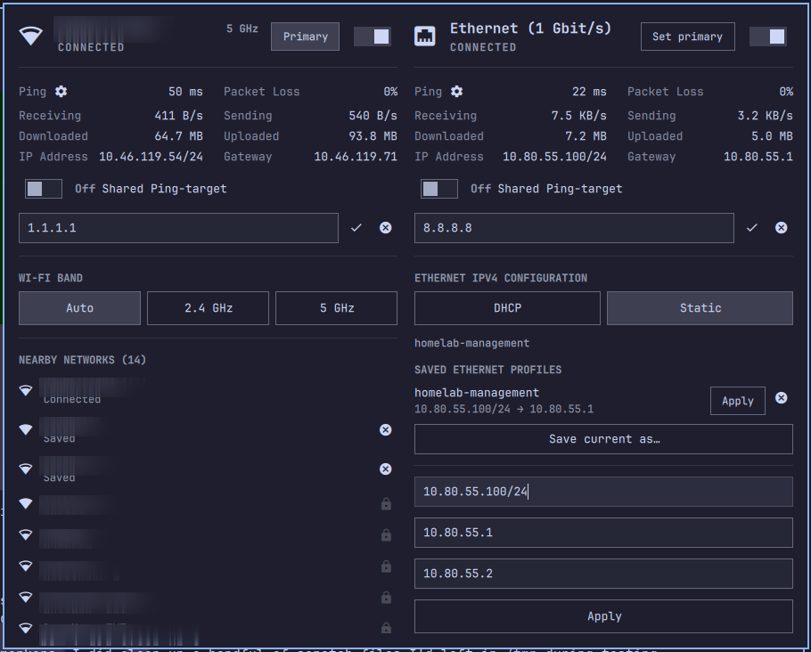

# SimulNetDevice

An Omarchy (Quickshell) plugin for managing Wi-Fi and Ethernet
independently, at the same time.

**Static IPv4 expanded**



## Why this exists

The built-in `omarchy.network` plugin only ever reports on whichever
interface currently owns the default route. If Wi-Fi and Ethernet are both
connected — two different networks, say — the built-in plugin shows exactly
one of them and hides the other entirely. Every status query in SimulNetDevice is
scoped directly to a specific interface instead, so both show up correctly
no matter which one is carrying the default route.

The built-in plugin is left untouched and can be re-enabled as a fallback
(`omarchy plugin enable omarchy.network`) if this one ever breaks.

## Running alongside the built-in plugin

You don't have to disable `omarchy.network` to use SimulNetDevice. If it's still
enabled, SimulNetDevice shows a small banner with a "Disable it" button (or the
equivalent `omarchy plugin disable omarchy.network` command, if you'd
rather run it yourself) and a "Keep both" button that remembers your
choice for good — it won't ask again unless you delete
`~/.config/simulnetdevice/hide-network-conflict-notice`.

Running both at once is safe day to day. The one thing to know: if both
popups happen to be open at the same time, Wi-Fi network scanning can
briefly stop in whichever one you leave open — it corrects itself as soon
as you reopen either popup, so at worst you see a stale nearby-networks
list for a moment. See `ARCHITECTURE.md` if you want the technical reason
why.

## Installation

```bash
omarchy plugin add https://github.com/mattyd-ip/simulnetdevice --enable
```

Or, from a local clone:

```bash
git clone https://github.com/mattyd-ip/simulnetdevice ~/.config/omarchy/plugins/simulnetdevice
omarchy plugin enable simulnetdevice
```

**Requires:** NetworkManager (`nmcli`), `jq`, and `ping` — all present on a
stock Omarchy install.

## Uninstall

```bash
omarchy plugin remove simulnetdevice
```

This disables and removes the plugin (backing up the folder first if it
wasn't a git checkout). It leaves `~/.config/simulnetdevice/` — saved
static-IP profiles and the "keep both" conflict-banner preference — in
place; add `rm -rf ~/.config/simulnetdevice` to also clear those.

## Current features

- **Independent Wi-Fi + Ethernet, live and side by side** — connection
  state, SSID/link speed, IP, gateway, ping, packet loss, and
  download/upload rate + totals, tracked separately per interface rather
  than shared from one default-route sample. Both show as side-by-side
  columns while both are connected, dropping to a single column the
  moment either one isn't.
- **Set primary** — choose which connected network actually carries your
  internet traffic, instead of NetworkManager's built-in
  wired-always-wins default. Lets Wi-Fi stay primary with a cable
  plugged in, or vice versa.
- **Saved static-IP profiles (Ethernet)** — name an address/gateway/DNS
  combo once (e.g. "Office LAN") and reapply it with one click later
  instead of retyping it. Click "Static" to reveal your saved profiles;
  picking one applies immediately. The active profile's name stays
  visible under the Static button even when the panel is collapsed.
  Stored at `~/.config/simulnetdevice/profiles.json`.
- **DHCP / Static IPv4 toggle** for Ethernet.
- **Wi-Fi scanning, joining, and forgetting** — a scrollable list of
  nearby networks sorted connected/known-first, a password prompt when
  one's needed, and a forget button for saved networks.
- **Wi-Fi radio on/off** toggle.
- **Wi-Fi band selection** — pin to 2.4/5/6GHz or leave on Auto, offered
  when a network answers on more than one band.
- **Ethernet connect/disconnect** toggle.
- **Automatic recovery from a stuck connection** — sustained ping loss
  cycles the Wi-Fi radio or Ethernet link automatically, the same fix
  you'd do by hand.
- **Full keyboard navigation** — `j`/`k`/`h`/`l` (or arrows) to move,
  `Space`/`Enter` to activate, `x` to forget/delete, `Tab` to switch
  plugins, `Escape` to close.

See [`CHANGELOG.md`](CHANGELOG.md) for what's changed recently.

## Tested on

Omarchy 4.0.2 (Arch Linux, kernel 7.1.9-arch1-2) on a Lenovo ThinkPad E15
Gen 2, NetworkManager (`nmcli` 1.58.1), one Wi-Fi adapter + one wired
Ethernet adapter. See Known limitations below for what's untested (a
second adapter of the same type, non-Arch systems, etc.).

## Known limitations

- **No WPA-Enterprise (802.1x) networks.** Scanning/joining covers
  WPA2/WPA3-Personal, WEP, and open/OWE networks. Enterprise networks (the
  kind that ask for an identity + password, common on corporate/campus
  Wi-Fi) still need the built-in `omarchy.network` plugin.
- **No QR-code Wi-Fi sharing, speed test shortcut, or system-wide DNS
  provider quick-switch.** These are the built-in plugin's job (the first
  two are just shortcut buttons to the separate `omarchy.wifiqr` and
  `omarchy.speedtest` plugins, both still reachable on their own if
  enabled; the DNS quick-switch changes DNS for the whole system, not one
  interface).
- **IPv4 only.** No IPv6 configuration.
- **Static-IP profiles are Ethernet-only.**
- **One Wi-Fi + one Ethernet interface, assumed.** A second adapter of the
  same type (a second Wi-Fi card, or an onboard + dock/USB Ethernet NIC) is
  invisible to SimulNetDevice — no error, it just never appears.

## Troubleshooting

**Ping spikes, packet loss, or a blank Gateway (including a connection
that shows "Connected" but has no real network access)** — most often
right after changing a connection or a setting (switching networks,
toggling the radio, applying a static IP, and similar).

Start by closing and reopening the panel — this refreshes every value
from scratch and clears up most of these on its own. If it doesn't, the
fix is to actually drop and re-establish the physical link, not just
change a setting in the panel:

- **Wi-Fi**: toggle the radio off and back on (from the panel, or
  physically if your device has a hardware switch), disconnect and
  reconnect to the same network, or connect to a different SSID and back.
- **Ethernet**: reseat the cable (unplug and replug it), or apply a
  **Static IPv4** profile for the network instead of DHCP.

This isn't something SimulNetDevice or NetworkManager detects or fixes on its
own. It's a lower-level issue with how this particular combination of
plugin, NetworkManager, OS, and this workstation's hardware handles the
connection — not something seen with other similar tools.
